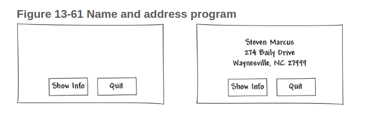

# Instructions  

Write a GUI program that displays your name and address when a button is clicked. The program’s window should appear as the sketch on the left side of Figure 13-61 when it runs. When the user clicks the Show Info button, the program should display your name and address, as shown in the sketch on the right of the figure.

Review [The Name and Address Problem](https://mediaplayer.pearsoncmg.com/assets/gaddis_sowp6e_Name_and_Address_Problem) VideoNotes. You will see the output you should have for this programming challenge as well as the code.