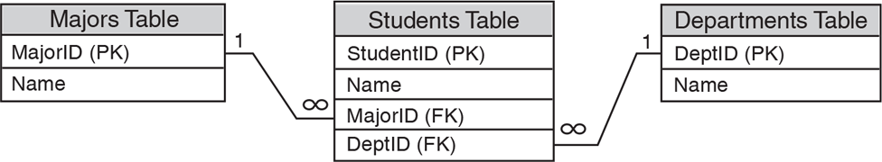

# Instructions 

In this assignment, you will create a database named `student_info.db` that holds the following information about students at a college:

* The student’s name
* The student’s major
* The department in which the student is enrolled 

The database should have the following tables:

### Majors Table

| Column Name | Data Type |
| ----------- | --------- |
| MajorID | INTEGER PRIMARY KEY |
| Name | TEXT |

### Departments Table

| Column Name | Data Type |
| ----------- | --------- |
| DeptID | INTEGER PRIMARY KEY |
| Name | TEXT |

### Students Table

| Column Name | Data Type |
| ----------- | --------- |
| StudentID | INTEGER PRIMARY KEY |
| Name | TEXT |
| MajorID | INTEGER (Foreign key that references the MajorID column in the Majors table) |
| DeptID | INTEGER (Foreign key that references the DeptID column in the Departments table) |

The following image shows an entity relationship diagram for the database.

* Write a program that creates the database and the tables. 

* Write a program that performs CRUD operations on the `Majors` table. Specifically, the program should allow the user to do the following:
  - ___ Add a new major
  - ___ Search for an existing major 
  - ___ Update an existing major 
  - ___ Delete an existing major 
  - ___ Show a list of all majors 

* Write a program that performs CRUD operations on the `Departments` table. Specifically, the program should allow the user to do the following:
  - ___ Add a new department 
  - ___ Search for an existing department 
  - ___ Update an existing department 
  - ___ Delete an existing department 
  - ___ Show a list of all departments 

* Write a program that performs CRUD operations on the `Students` table. Specifically, the program should allow the user to do the following: 
  - ___ Add a new student
  - ___ Search for an existing student 
  - ___ Update an existing student 
  - ___ Delete an existing student 
  - ___ Show a list of all students

When adding, updating, and deleting rows, be sure to enable foreign key enforcement. 

When adding a new student to the Students table, the user should only be allowed to select an existing major from the Departments table, and an existing department from the Departments table.
