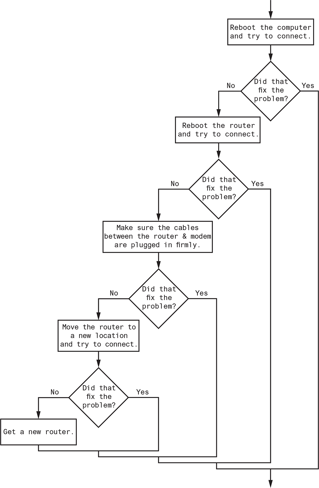

# Instructions  

The Wi-Fi Diagnostic Tree Flowchart shows a simplified flowchart for troubleshooting a bad Wi-Fi connection. Use the flowhart to create a program that leads a person through the steps of fixing a bad Wi-Fi connection. Here is an example of the program's output:



```python
Reboot the computer and try to connect.
Did that fix the problem? no [Enter]
Reboot the router and try to connect.
Did that fix the problem? yes [Enter]
```

Notice the program ends as soon as a solution is found to the problem. Here is another example of the program’s output:

```python
Reboot the computer and try to connect. 
Did that fix the problem? no [Enter] 
Reboot the router and try to connect. 
Did that fix the problem? no [Enter] 
Make sure the cables between the router and modem are plugged in firmly. 
Did that fix the problem? no [Enter] 
Move the router to a new location. 
Did that fix the problem? no [Enter] 
Get a new router.
```